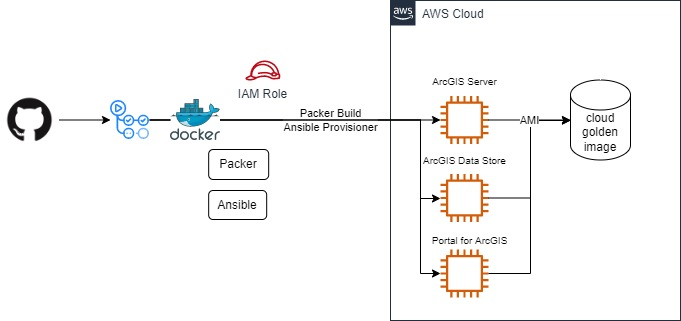

# ArcGIS Enterprise Golden Image for AWS

This project is designed to create ArcGIS Enterprise golden images automatically.



Esri's AWS Image is so helpful for your AWS deployment. This image have all components.
https://enterprise.arcgis.com/en/server/latest/cloud/amazon/arcgis-server-amis.htm

However, not all cases require all components. Therefore I decided to create a simple image with each component installed automatically.

This project will make three golden images for each components(ArcGIS Data Store/ArcGIS Server/Portal for ArcGIS).

# Feature

You can get a simple AMI Image ArcGIS Enterprise component installed automatically.

I choose [Ansible](https://docs.ansible.com/ansible/2.9_ja/index.html) as a provisioning tool.
Ansible is used as a provisioning tool to install ArcGIS Enterprise because Ansible is simple, agentless.

You can get three amis:

    - ArcGIS Data Store AMI: installed only ArcGIS Data Store.
    - ArcGIS Server AMI: installed only ArcGIS Server.
    - Portal for ArcGIS AMI: installed only Portal for ArcGIS and WebStyles(for scene view).


# Other technologies in this project

* Packer is used for creating aws ami resource.
* GitHub Action

# Requirements

1. Prepare ArcGIS Enterprise installers in the S3 bucket.

    Note: if running Packer and Ansible locally, please check the network settings. Ansible provisioner will run through winrm and ssh(linux).

If you run action through GitHub Action, prepare the following:

2. Prepare AWS IAM Role for Github Action and configure your GitHub Action

    [GitHub AWS oidc settings]
    (https://docs.github.com/en/actions/deployment/security-hardening-your-deployments/configuring-openid-connect-in-amazon-web-services)

3. Prepare key pair file in parameter store.

    In my action, download the private key file from Parameter Store.

# Usage

1. Clone this repo
2. Edit Ansible variables for installation for ArcGIS Enterprise 
    
    Variables to edit are:
    - vars_arcgisportal.yaml
    - vars_arcgisserver.yaml
    - vars_arcgisdatastore.yaml

    See the details for [ansible-install-arcgis](https://github.com/atzhit7/ansible-install-arcgis)
    
    **NOTE: Other variables files such as vars_dev_...yaml can be used in the case you want to prepare images for dev and prod seprately. In Packer build, these variables are used.**

3. Check Packer build file.

    aws.pkr.hcl have some builds for AMI.
    
    * Windows Server 2019/2022
    * Ubuntu 20.04

    The **source** section is the base configuration of ami.

    * sample source
    ```
    source "amazon-ebs" "windowsserver2019" {
    # AMI
    region  = var.region
    instance_type = var.aws_connection.instance_type
    # Access (local. the aws configure action is used on github action)

    temporary_iam_instance_profile_policy_document {
        Statement {
            Action   = ["s3:*","logs:*"]
            Effect   = "Allow"
            Resource = ["*"]
        }
        Version = "2012-10-17"
    }
    # Assume Role (local. the aws configure action is used on github action)
    # Polling
    aws_polling {
        delay_seconds = 30
        max_attempts = 120
    }
    # Run
    source_ami_filter {
        filters = {
        name             = "Windows_Server-2019-Japanese-Full-Base*"
        root-device-type = "ebs"
        }
        owners      = ["801119661308"]
        most_recent = true
    }
    communicator = var.aws_connection.win_communicator
    winrm_username = var.aws_connection.winrm_username
    user_data_file = var.aws_connection.user_data_file
    ssh_keypair_name = "aws-example-key"
    ssh_private_key_file = var.aws_connection.ssh_private_key_file
    }
    ```
    ---

    In **build** section, I defined new sources configuration for each ArcGIS Enterprise Component AMIs inherited from the **source** configuration.

    **NOTE: "dev-" prefix is used for development AMI. No prefix build name is assumed for production AMI**

    * sample build section for development.

    ```
    build {
        name = "dev-windowsserver2019"

        source "source.amazon-ebs.windowsserver2019" {
            ami_name      = "dev-arcgisserver-${local.timestamp}"
            name = "win-arcgisserver"
            tags = {
                OS_Version = "Windows"
                OS_Release = "2019"
                Base_AMI_ID = "{{ .SourceAMI }}"
                Base_AMI_Name = "{{ .SourceAMIName }}"
                AMI_ROLE = "dev-arcgisserver"
                AMI_Release = "${local.timestamp}"
                Name = "dev-arcgisserver-${local.timestamp}"
            }
            launch_block_device_mappings {
                device_name = "/dev/sda1"
                volume_size = 90
                volume_type = "gp2"
                delete_on_termination = true
            }
        }
        …
        …

        provisioner "ansible" {
            only = ["amazon-ebs.win-arcgisserver"]
            playbook_file           = var.ansible_playbooks.arcgisserver_playbook_file
            user                    = var.aws_connection.winrm_username
            ansible_env_vars    = [
                "ANSIBLE_HOST_KEY_CHECKING=False",
                "ANSIBLE_NOCOLOR=True",
                "ANSIBLE_DEBUG=0"
            ]
            extra_arguments = [
            "-e",
            "'ansible_python_interpreter=C:\\Python39\\bin'"
            ]
            use_proxy               = false
        }
        …
        …
        provisioner "powershell" {
            only = ["amazon-ebs.win-arcgisdatastore", "amazon-ebs.win-arcgisserver", "amazon-ebs.win-arcgisportal"]
            scripts = [var.provisioningscripts[1]]
        }
    }
    ```

4. Create Packer build varible.

    * sample pkvars.hcl:

    ```json
    aws_connection = {
        "instance_type" = "t3.large"
        "user_data_file" = "../scripts/win_rm.txt"
        "win_communicator" = "winrm"
        "winrm_username" = "Administrator"
        "ssh_username"  = "ubuntu"
        "ssh_keypair_name" = "aws-example-key"
        "ssh_private_key_file" = "../ansible/privatekey"
    }
    
    ansible_playbooks = {
        "arcgisserver_playbook_file"  = "../ansible/arcgisserver.yaml"
        "arcgisportal_playbook_file"  = "../ansible/arcgisportal.yaml"
        "arcgisdatastore_playbook_file"  = "../ansible/arcgisdatastore.yaml"
    }

    provisioningscripts = [
        "../scripts/aws_windows_sysprep.ps1",
        "../scripts/aws_windows_sysprep_2019.ps1",
    ]
    ```

    **NOTE: In my sample, I create aws-dev.pkrvars.hcl for "development" and aws.pkrvars.hcl for "production" as the following workflow.**

    **NOTE: The privatekey(for key pair) should be stored at the SSM Parameter Store as Secure String. In my sample workflow, I prepared the action to download the privatekey from the parameter store into ansible directory. You can set the "ssh_private_key_file" variable to the downloaded path.**

## Run through Github Action

I prepared the sample workflow.
Go to the sample workflow is [here](.github/workflows/aws-build.yaml).

This workflow has three input parameters:

    * target -> dev/prod

        The build target you want to create.

    * region -> ap-northeast-1/ap-northeast-2/ap-southeast-1/ap-southeast-2
        
        AWS region you want to create golden image.
        
        For other regions, please modify the choice parameters.

    * windowsversion -> windows server 2019 base image/windows server 2022 base image source

        Choise the version you want to create.

Packer validate and build actions are the following.

* Packer validate for development ami:

    ```packer validate -syntax-only -var-file aws-${{ env.BUILD_TARGET }}.pkrvars.hcl -var region=${{ env.AWS_REGION }} -only ${{ env.BUILD_TARGET }}-windowsserver${{ env.WINDOW_VERSION }}.* aws.pkr.hcl```

* Packer build for development ami:

    ```packer build -color=false -on-error=abort -var-file aws-${{ env.BUILD_TARGET }}.pkrvars.hcl -var region=${{ env.AWS_REGION }} -only ${{ env.BUILD_TARGET }}-windowsserver${{ env.WINDOW_VERSION }}.* aws.pkr.hcl```

* Packer validate for production:

    ```packer validate -syntax-only -var-file aws.pkrvars.hcl -var region=${{ env.AWS_REGION }} -only windowsserver${{ env.EGIHS_WINDOW_VERSION }}.* aws.pkr.hcl```

* Packer build for production:

    ```packer build -color=false -on-error=abort -var-file aws.pkrvars.hcl -var region=${{ env.AWS_REGION }} -only windowsserver${{ env.WINDOW_VERSION }}.* aws.pkr.hcl```

In this way, this workflow is designed to use these parameters to switch Packer variable file and build target.

## Option: Run testing action using [act](https://github.com/nektos/act)

This workflow will takes about 1 hours to create amis.
Because of the limit of GitHub Action running time (free tire), the local running is helpful to test GitHub Action.

1. Prepare the action yaml with trigger on push under .github/workflow/.

    1. copy the exisiting action yaml.
    2. edit the environments info (with Upper cases) and change the "push" trigger to run.
    
        ```yaml
        on:
            push:
        
        env:
            AWS_REGION: YOUR REGION
            AWS_ROLE_ARN: arn:aws:iam::${{ secrets.AWS_ACCOUNT_ID }}:role/xxxxxxxxxx # this is not used on act. stay as it is.
            ROLLE_SESSION_NAME: GithubAction-PackerBuild # this is not used on act. stay as it is.
            PACKER_VERSION: 1.8.1
            PYTHON_VERSION: 3.8
            ANSIBLE_VERSION: 5.9.0
            CREATE_TARGET: DEVPROD TARGET (IE. dev/prod)
        ```

    3. comment out the following actions.

        '- name: check if there is a crash log with unexcepted error'

        '- name: Error handling'

        **NOTE: The docker image I tested does not find powershell core. But the current GitHub Action Ubuntu docker seems to have Powershell core.**

2. type the following key.

    `act -s AWS_ACCESS_KEY_ID=YOURKEY -s AWS_SECRET_ACCESS_KEY=YOURSECRETKEY`

    You can also use an act parameter file including the aws keys.

## ISSUE

    * Delete Packer profile

    At this time, packer temporal instance role cannot be deleted. So please delete it manually after creating image.

## Optional

[Ansible Project to install ArcGIS](https://github.com/ansible-install-arcgis) repository is only for Ansible.

If you want to install ArcGIS Enterprise in your existing local machine or Virtual machines, use that repository Ansible project.

[Comming soon - arcgis provisioning]() repository can help you to deploy ArcGIS Enterprsie base deployment on your AWS using the image created with this repository.
For more details including the system architecture, please check that repo.